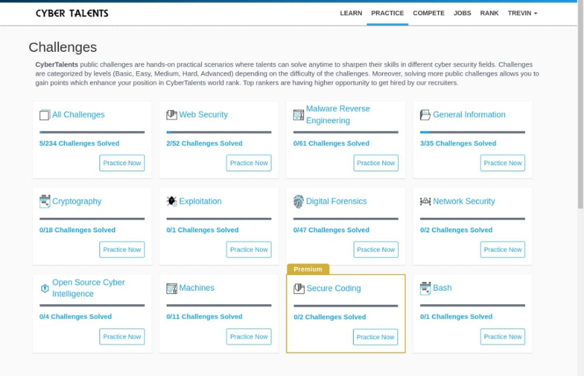
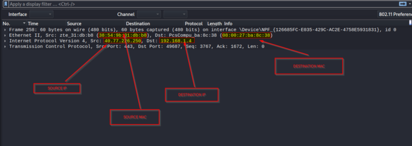

<div id="top"></div>

<!-- PROJECT LOGO -->
<br />
<div align="center">
  <a href="https://github.com/github_username/repo_name">
    
  </a>
<h3 align="center">Cyber Talents Challenges by {CyberTrev}</h3>

  <p align="center">
A number of solved challenges on cybertalents platform     <br />
    <a href="https://cybertalents.com/"><strong>Cyber Talents »</strong></a>
    <br />
  </p>
</div>

<!-- TABLE OF CONTENTS -->
<details>
  <summary>Table of Contents</summary>
  <ol>
    <li>
      <a href="#about-the-project">About The Project</a>
      <ul>
        <li><a href="#built-with">Built With</a></li>
      </ul>
    </li>
    <li>
      <a href="#getting-started">Getting Started</a>
      <ul>
        <li><a href="#prerequisites">Prerequisites</a></li>
        <li><a href="#installation">Installation</a></li>
      </ul>
    </li>
    <li><a href="#usage">Usage</a></li>
    <li><a href="#roadmap">Roadmap</a></li>
    <li><a href="#contributing">Contributing</a></li>
    <li><a href="#license">License</a></li>
    <li><a href="#contact">Contact</a></li>
    <li><a href="#acknowledgments">Acknowledgments</a></li>

  <li>
      <a href="#about-the-project">Introduction to Cybersecurity</a>
      <ul>
        <li><a href="#introduction-to-ctf">introduction to ctf</a></li>
         <li><a href="#introduction-to-web-security">introduction to web security</a></li>
          <li><a href="#html">HTML</a></li>
           <li><a href="#javascript">javascript</a></li> <li><a href="#cookies">Cookies</a></li> <li><a href="#hashing">hashing</a></li> <li><a href="#encoding">encoding</a></li> <li><a href="#obfuscation">obfuscation</a></li> <li><a href="#xss">xss</a></li> <li><a href="#directory-traversal">directory-traversal</a></li> <li><a href="#built-with">Sensitive Data Exposure</a></li> <li><a href="#built-with">Cyber security Overview</a></li> <li><a href="#built-with">Burpe Suite</a></li> <li><a href="#built-with">Command Injection</a></li>
            <li><a href="#built-with">Code Injection</a></li>
         <li><a href="#built-with">SQL Injection</a></li>
          <li><a href="#built-with">Introduction To Digital Forensics</a></li>
           <li><a href="#built-with">Meta Data</a></li> <li><a href="#built-with">Steganography</a></li> <li><a href="#built-with">Audio Forensics</a></li> <li><a href="#built-with">Wireshark</a></li> <li><a href="#built-with">Netcat</a></li> <li><a href="#built-with">Memory Forensics</a></li> <li><a href="#built-with">Introduction to reverse Engineering</a></li> <li><a href="#built-with">Intel-x86 - Architecture</a></li> <li><a href="#built-with">Introduction to cryptography</a></li> <li><a href="#built-with">Morse code</a></li> <li><a href="#built-with">Ceasar Cipher</a></li>
            <li><a href="#built-with">Hash Cracking</a></li>
      </ul>
    </li>
    
<li>
  <a href="#intro-to-cybersecurity-bootcamp-2022">Intro to Cybersecurity Bootcamp 2022
</a>

<ul>
 <li><a href="#introduction-to-ctfs">introduction to ctfs</a></li>
 <li><a href="#cybersecurity-overview">cybersecurity overview</a></li>
  <li><a href="#attacks-and-vulnerabilities">attacks and vulnerabilities</a></li> <li><a href="#network-security-fundamentals">network security fundamentals</a></li> <li><a href="#wireshark">wireshark</a></li> <li><a href="#osi-model">osi model</a></li>
</ul>
</li>
  </ol>


</details>

<!-- ABOUT THE PROJECT -->

## About The Project

 

<p align="right">(<a href="#top">back to top</a>)</p>

<!-- GETTING STARTED -->

## Getting Started

This is an example of how you may give instructions on setting up your project locally.
To get a local copy up and running follow these simple example steps.

<!-- ROADMAP -->

## Roadmap

- [ ] Feature 1
- [ ] Feature 2
- [ ] Feature 3
  - [ ] Nested Feature

<!-- LICENSE -->

## License

Distributed under the MIT License. See `LICENSE.txt` for more information.

<p align="right">(<a href="#top">back to top</a>)</p>

<!-- CONTACT -->

## Contact

Cyber Trev - [@cybertrev](https://twitter.com/cybertrev)

Project Link: [https://github.com/trevin-livele/Cyber_Talents_Challenges](https://github.com/trevin-livele/Cyber_Talents_Challenges)

<p align="right">(<a href="#top">back to top</a>)</p>


## introduction to ctf

<h4>CTF stands for Capture The Flag. This is a type of cybersecurity competition or game with the purpose to locate a particular piece of text called a flag that may be on the server or behind a web page</h4>

````

Introduction to CTF » Pay Me Challenge

flag{ransomeware}

````
<p align="right">(<a href="#top">back to top</a>)</p>

## introduction to web security

I am a cyber security conference that run in August every year in Las Vegas. I am the largest gathering for Hackers in the whole world. No Credit cards, no online booking , Only Cash allowed . Who am I ?

````

Introduction to Web Security » Hackers Gathering 

flag{defcon}

````
<p align="right">(<a href="#top">back to top</a>)</p>

## html

True or False , htmlentities ( convert special characters to its html entity ) can't be exploited to run XSS payload ?

````

HTML » htmlentities 

True

````
<p align="right">(<a href="#top">back to top</a>)</p>

## javascript

1. Enter the website provided in the challenge and you'll be redirected to a login page
2. View the page source of the webpage by right clicking and selecting 'View Page Source'
3. In the source code you'll find a script that is encoded in ascii-hex
4. Decoded this using an online decoder such as this one
After decoding it you would get a simplified code that includes an array with multiple variables followed by an if statement
5. Rearrange the decoded script so it's more readable
After doing so, you'll be able to see that the if statement will redirect you to a page if both the first variable and second variable are equal to the 5th value in the array (Cyber-Talent)
6. Input that in both the username and password of the original webpage and you will be redirected to a page with the flag 
````
JavaScript » This is Sparta 

flag{J4V4_Scr1Pt_1S_Aw3s0me}

````

<p align="right">(<a href="#top">back to top</a>)</p>

## cookies

### What are Cookies?

Cookies are data that browsers store in small text files on your computer.Cookies were invented to solve the problem of "how to remember information about the user?". 
When you sign in to a web application, you won’t need to type your email and password again next time because it stores your credentials in the cookies.


1. Enter the website provided in the challenge and you'll be redirected to a login page.

2. View the page source of the webpage by right clicking and selecting 'View Page Source'.

3. You'll find a comment that includes support username and password.

4. TODO: remove this line , for maintenance purpose use this(user:support password:x34245323)

5. Trying to use these credentials would only redirect you to the support page with no flag.

6. Next you want to open up burp suite and intercept your requests.

7. Try logging back in again with the same credentials but this time with proxy intercept on.

8. You'll find that there is a role variable that is set to support, change that to admin and forward your request.

9. After forwarding your request you should see a new webpage that includes the flag.

````
Cookies » Admin has the power 

flag{hiadminyouhavethepower}
````

<p align="right">(<a href="#top">back to top</a>)</p>

## hashing

Hashing is the process of transforming any given key or a string of characters into another value. This is usually represented by a shorter, fixed-length value or key that represents and makes it easier to find or employ the original string

### Hashing » Hash3rror 

we got this corrupted hash password from a Pcap file with a note (password = sha-1(hash-result)).

```
HASH:77be5d24ed2e3e590045e1d6o7e84i50d2799c19f48ede46804a8734e287df120f
```
Solution: Look at the hash 
```
77be5d24ed2e3e590045e1d6o7e84i50d2799c19f48ede46804a8734e287df120f
```
It's basically in hex format, right? But no, it has two illegal characters: o and i. Let's remove that. Now, it's 64 characters long, which is the length of a sha-256 hash.

We get the plaintext s3cr3tpassword. Now, as per instruction, we've to sha-1 encrypt it. After encryption, we get 

````
flag{83874343435092cb681c0d558a84bfeb389c32ed}
 ````

<p align="right">(<a href="#top">back to top</a>)</p>


## encoding

Encoding is the process of converting a sequence of letters , characters and any other special characters into a specialized format for transmission.Decoding is the reverse of the encoding process


## Encoding » who am i? 

1. Open the challenge && open the source code i.e ```view page source``` or ```inspect element```
2. You get guest Account with Username   ``Guest`` and password as ``Guest``

3. Open Burpe suite to intercept the request
4. input the creds in the browser and forward in burp
5. You get a token decode it as it is base64 encoded.After decoding we get it as ```admin```
6. copy the encoded string replace it in burp and forward to get the flag.

```
flag{B@D_4uTh1Nt1C4T1On}
```
<p align="right">(<a href="#top">back to top</a>)</p>

## obfuscation

What is obfuscation?

Obfuscation is the process of modifying the script to convert it to a difficult,harder-to-understand format, but it will return the same result.

```
Obfuscation » Modify Code 

flag{Obfuscation}

```

Obfuscation » Iam Legend 
If I am a legend, then why am I so lonely?


1. Enter the website provided in the challenge and you'll be redirected to a login page

2. View the page source of the webpage by right clicking and selecting 'View Page Source'

3. You'll find a script that is obfuscated in a weird format doing some research, I found that it was obfuscated using an encoding called jsfuck

4. Going to the original decoder website and using their decoder did not work, as I only got "undefined"

5. I searched for different decoders online and found one called poisonJS that de-obfuscates eval based jsfuck obfuscations after using the decoder, we get multiple functions including the check function for the username and password

6. In the function, we see an if statement that includes the needed variables for the username and password.

```
(user=="Cyber" && pass=="Talent")
```
Entering those credentials will redirect you to a page with the Flag: 
```
flag{J4V4_Scr1Pt_1S_S0_D4MN_FUN}
```
<p align="right">(<a href="#top">back to top</a>)</p>

## xss

Cross-Site Scripting is a web vulnerability that relies on the client side , in which its purpose is to inject HTML (also called HTML injection) or to run JavaScript code in the user’s browser.

XSS » Searching for the cookie 

simple search website we need to know which cookie to eat ;)

#### execute line by line in the input box

```
</script><script>alert(1);</script>

</script><script>alert(document.cookie);</script>

x = try+to+execute+some+jst flag=coolcookie112

flag{coolcookie112}

```
<p align="right">(<a href="#top">back to top</a>)</p>


## intro-to-cybersecurity-bootcamp-2022

## introduction-to-ctfs

```
*Introduction to CTF » competition 

Special kind of cybersecurity competition designed to challenge its participants to solve computer security problems

flag{CTF}

```

## cybersecurity-overview

What is Cybersecurity?

Cyber security is a branch of security that focuses on protecting systems, networks, computers, and data, from unauthorized access (intentional and unintentional), modification, or destruction.

```
*Cybersecurity Overview » fisher 


flag{bugbountyhunter}

```

## attacks-and-vulnerabilities


What is a Cyber Attack?

A cyber attack is an offensive act to make a computing device function maliciously, with the intent of stealing user credentials, gaining unauthorized access to a target system, disrupting services, and so many other intentions.

Description

~ we got the evidence for the phishing Email but we need to know the name of malware file
Copy the link https://hubchallenges.s3-eu-west-1.amazonaws.com/Forensics/mail_bak.7z and download the file as shown below in terminal:
```
*Attacks & Vulnerabilities » Mailer 

wget https://hubchallenges.s3euwest1.amazonaws.com/Forensics/mail_bak.7z

Use the command → /usr/bin/p7zip -d — decompress — uncompress mail_bak.7z

Now open the document names “Sent” using your text editor. Then search or grep “.exe” to get the flag.

~ Cheers! Guess what? Your flag is: flag{Mal_strike8941934890753353453.exe}
```

## network Security fundamentals

*Network Security Fundamentals » Mask 

```
flag{255.255.255.0}

```
## wireshark

 Wireshark is the world’s foremost and widely-used network protocol analyzer. It lets you see what’s happening on your network at a microscopic level.

 mac os install  ```https://www.wireshark.org/download.html```

 linux install
 ```
 sudo add-apt-repository ppa:wireshark-dev/stable

 sudo apt-get update

 sudo apt-get install wireshark

 sudo dpkg-reconfigure wireshark-common

sudo adduser $USER wireshark
 ```

Then restart your machine and open Wireshark.

*Wireshark » cl34r 


Copy the link https://hubchallenges.s3.eu-west-1.amazonaws.com/Forensics/cl34r.pcapng and download the file as shown below in terminal:

```
wget https://hubchallenges.s3.eu-west-1.amazonaws.com/Forensics/cl34r.pcapng

file cl34r

strings cl34r.pcapng

```

And moving down the output of the command look what we find? A flag :

````
flag{Th1s_15_t0_cl34r}
````

*Wireshark » Anonymous 

Can you trace the anonymous guy? 

```
wget https://hubchallenges.s3-eu-west-1.amazonaws.com/Forensics/anonymous.pcap

file anonymous.pcap

string anonymous.pcap

```
Use an online decoding site for Base64 and guess what? Your flag is:
```
flag{anonymous_t0_th3_end}

```

## OSI Model
Open Systems Interconnection Model (OSI) is a conceptual framework used to describe the functions of a networking system. 

*OSI Model » http 
could you know the content of ctweb.com on server?
```
username: ctf

password: ctf

```
open the link http://wlem4m2366qcg3011y3e1e0sxzm61xvky2j9blz0-web.cybertalentslabs.com/ on a web server and login with the creds above.

The web server content is usually in /var/www so let’s navigate to that directory.

You’ll find the ctweb.com directory, view the directory’s content and you’ll get the flag.

````
flag{htt9_pR0toc01}

````

*OSI Model » address 

(What is the source and destination IP/MAC for packet number 258

Mac address in small letters.)


Flag format: flag{Source IP/Source MAC/Destination IP/Destination MAC}

Download the link https://hubchallenges.s3.eu-west-1.amazonaws.com/foren/Wireshark101.pcapng on the terminal as show below:

```
wget  https://hubchallenges.s3.eu-west-1.amazonaws.com/foren/Wireshark101.pcapng
````
Open the file on Wireshark to capture the packets,next,navigate to number 258 and click

 

Flag format: flag{Source IP/Source MAC/Destination IP/Destination MAC}

3.Walla your flag is:
```
flag{40.77.226.250/38:54:9b:31:db:b8/192.168.1.4/08:00:27:ba:8c:38}
```


## directory-traversal

Accessing files or data in a web application outside the root folder

```
python3 dirsearch.py -u <url link>

```

burpsuite => https://portswigger.net/

dirbuster=> https://wiki.owasp.org/index.php/Category:OWASP_DirBuster_Project

https://github.com/xmendez/wfuzz/blob/master/wordlist/Injections/Traversal.txt


Navigate to bean/files../home/flag.txt  after conducting a directory search

```
http://wlemyw93xjyc7zr8r4gvmkxal3dm4gvmwe6gsl3d-web.cybertalentslabs.com/files../home/flag.txt


FLAG{Nginx_nOt_aLWays_sEcUre_bY_The_waY}
```

## Sensitive Data Exposure
Sensitive Data Exposure » Maximum Courage 


<h1>tools</h1>

https://portswigger.net/

https://wiki.owasp.org/index.php/Category:OWASP_DirBuster_Project

https://github.com/internetwache/GitTools
```
Download the file
Open in text editor

https  /maximum/.git/refs/heads/master

wget -r <url>
ls
cd maximum
ls-la
cd .git
ls
git restore flag.php
cat flag.php

hash => be607453caada6a05dooc0ea0057f733
```

use https://portswigger.net/  {burp suite}

flag{sessionareawesomebutifitsecure}

## command Injection

injecting os commands on a web app


## code injection
Allows attacker to inject malicious code to the web application

flag 
```
18ab51f960bd149bcb2497b9998c752c
```


## Sql injection


What is SQL Injection ?
a web vulnerability that allows the attacker to retrieve sensitive data from the application database by injecting an SQL query into one of the application functions that retrieves data for the user.

SQL Injection attacks types :

Inband: data is  retrieved using the same channel that is used to inject the SQL code.

Out-of-band: data is retrieved using a different channel (e.g., an email with the results of the query is generated and sent to the tester).

Blind: no error is shown as result for the SQL injection payload .
 

resources

https://github.com/fuzzdb-project/fuzzdb/tree/master/attack/sql-injection

http://sqlmap.org/

```
'1 or 1 --

flag{!injection_3v3r_wh3r3}

```

## Digital Forensics

flag 

```
forensics
```

## Meta Data


## Steganography

Embeding secrete message in a cover message

Steganography » Greeks 

flag
```
Steganography
```

## Audio-forensics

Audio Forensics » I love music 

deep sound is windows based tool to hide files inside audio files , it can hide or extract files from the audio file . 

https://docs.python.org/3/library/wave.html

https://academo.org/demos/spectrum-analyzer/

https://www.audacityteam.org/

sox tool . {kali linux}

use audacity to decode the audio

flag 
```
you_aree_victorious!
```

## wireshark


## Net Cat

Netcat is a utility that is able to write and read data across TCP and UDP network connections
In order to act as a backdoor we need Netcat to listen on a chosen port on the IIS

server (let's choose port 4444) and then we can connect to this port from our

attacking machine…using Netcat of course!

The command we want to give on the server looks like this:

nc -L -p 4444 -d -e cmd.exe

Here's what that command does:

nc - tells Windows to run the nc.exe file with the following arguments:

-L Tells netcat to not close and wait for connections

-p Specifies a port to listen for a connection on

-d Tells Netcat to detach from the process we want it to run.

-e Tells what program to run once the port is connected to (cmd.exe)


## memory forensics 
It helps detect unwanted and anonymous conduct on a target computer or server
 

RAW Format – Extracted from a live environment

Crash Dump – Information gathered by the operating system

Hibernation File – A saved snapshot that your operating system can return to after hibernating

Page File – This is a file that stores similar information that is stored in your system RAM

VMWare Snapshot – This is a snapshot of a virtual machine, which saves its state as it was at the exact moment that the snapshot was generated

monaliza


## Reverse Engineering


There is a lot of Disassembler tools like:

```
IDA
Ghidra
Binary Ninja
Cutter
gdb
```


There is a lot of Debuggers like:
```
IDA in the pro version.
gdb (linux)
x64 (windows)
```

hecking if the binary is obfuscated or packed
 

In this step we can use tools like 
```
pestudio,Peid or exeinfope
```
 if we are dealing with windows executable and for ELF files we can use tool like 
 ```
 elfparser.
```


## Introduction to Cryptography
is a model designed to guide policies for information security within an organization

Introduction to Cryptography » security model 

flag

```
CIA
```

## Hide Data 
Caesar Cipher » Hide Data 

I used to hide my data with a classic cypher, can you get the flag hidden inside?
gur synt vf 2w68lsudym Vg vf cerggl rnfl gb frr gur synt ohg pna lbh frr vg v gbbx arneyl 1 zvahgr gb rapbqr guvf jvgu EBG13 tbbq yhpx va fbyivat gung
  use this for conversion

https://codebeautify.org/rot13-to-text-converter

the flag is 
```
2j68yfhqlz 
```
It is pretty easy to see the flag but can you see it i took nearly 1 minute to encode this with ROT13 good luck in solving that

## Hash Cracking

Guess The Password

A hacker leaked the below hash online.
Can you crack it to know the password of the CEO?
The flag is the password
```
Hash: 06f8aa28b9237866e3e289f18ade19e1736d809d
```
Solution: Reversing the SHA-1 gives us
```
jrahyn+
```


